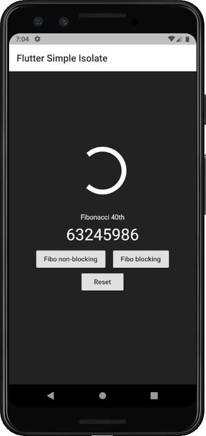
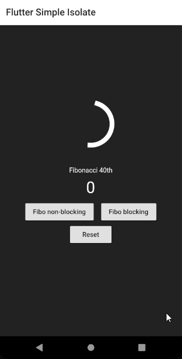
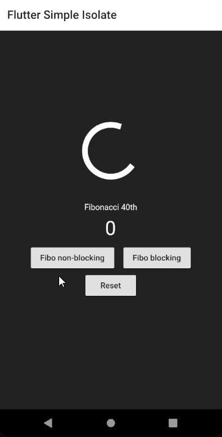

# Flutter Simple Isolate

A simple flutter app show how to use compute and basic Isolate.

 <p float="left">
  

</p>

<table >
  
  <tr>
    <th></th>
    <th></th>
  </tr>
  <tr>
    <th>Blocking</th>
    <th>Non-blocking</th>
  </tr>
</table >

## Getting Started

### Clone this project and access it directory

```
git clone https://github.com/Cheersupzoo/flutter_simple_isolate.git
cd flutter_simple_isolate
```

### Install dependency

```
flutter pub get
```

### Run the app

```
flutter run
```

- For smooth animation, recommend run in release/profile mode

### Testing

```
flutter test
```
